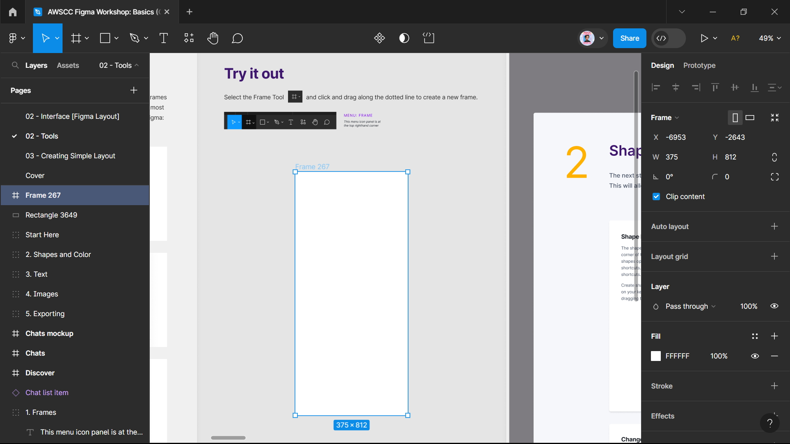
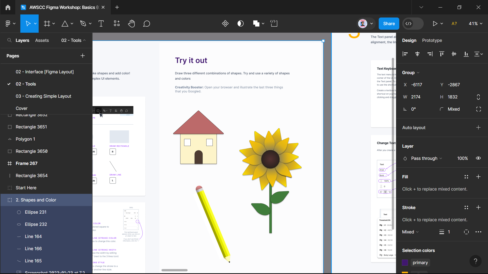

# ⋆⭒˚｡⋆ DAY 2 OF UI/UX ⋆⭒˚｡⋆

Remember, you're free to add your personal touch, but keep the sacred requirements intact; they are the guardians of order here. This markdown file should include:

**꒰ ♡ ꒱ Link to your own file of ***"Figma Basics Tutorial"***
  ☁︎ https://www.figma.com/file/3rZSKzQW8t6ejpovD1YuTi/AWSCC-Figma-Workshop%3A-Basics-(Community)?type=design&node-id=5-2085&mode=design&t=W1D2z2PD4FxAVu9P-0

**꒰ ♡ ꒱ Brief explanation of your experience or reflection**
  ☁︎ Figma is definitely intimidating on the first try, but I believe with enough effort and exploration, I will be able to master it. I have observed that it has a lot of features to offer, which allows for more design possibilities.

