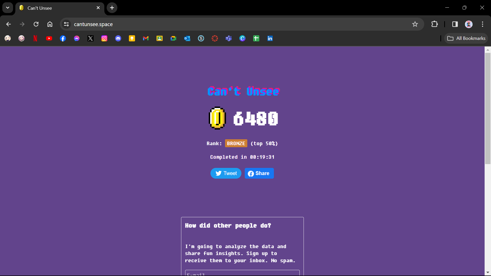

# ⋆⭒˚｡⋆ DAY 3: Design Principles ⋆⭒˚｡⋆

Remember, you're free to add your personal touch, but keep the sacred requirements intact; they are the guardians of order here. This markdown file should or may include:

**꒰ ♡ ꒱ Link to your own file of _"Week 1 [Day 3] : Activity"_**
  ☁︎ https://www.figma.com/file/6cxMQAPm1y9M0JQbPW8wUu/Week-1-%5BDay-3%5D-%3A-Activity-(Community)?type=design&node-id=407%3A93&mode=design&t=RUQx3mn2sMNovuvR-1

**꒰ ♡ ꒱ An _optional_ screenshot of playing the game _"Can't Unsee"_ and your feedback**
  ☁︎ I believe the game is an excellent way to hone a designer's eye for nitpicking even the smallest details in their designs. Personally, adding at least some soft background music will make the game more engaging.

